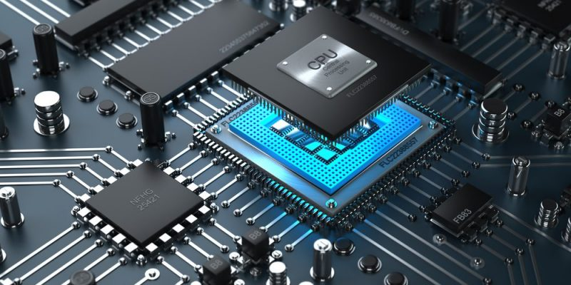

<h2 align="center">Learn Django &nbsp;:heart:&nbsp;</h2>



## Niveles 
- Pyhton, Ruby, C# (Alto Nivel)
- C (Nivel Intermedio) <br>
- <B>Ensamblador (Bajo Nivel)</B>
- Lenguaje Maquina


## Lenguaje ensamblador x86 💻

El lenguaje ensamblador x86 es la familia de los lenguajes ensambladores para los procesadores de la familia x86 introducida en abril de 1972, que incluye desde los procesadores Intel 8086 y 8088, pasando por los Pentium de Intel y los Athlon de AMD y llegando hasta los últimos procesadores x86 de estas compañías. Como el resto de lenguajes ensambladores, usa una serie de mnemotécnicos para representar las operaciones fundamentales que el procesador puede realizar. Los compiladores a menudo producen código ensamblador como un paso intermedio cuando traducen un programa de alto nivel a código máquina. Considerado como un lenguaje de programación de bajo nivel y específico para cada máquina. Aunque algunas veces es usado para software de aplicación de sistemas de ventanas, los lenguajes ensambladores son utilizados principalmente en aplicaciones críticas como sistemas de arranque, Sistemas Operativos, núcleos y en controladoras de dispositivos, así como en sistemas en tiempo real o pequeños sistemas

## Framework

Un Framework es un marco de trabajo formado por un conjunto de herramientas, librerias y buenas practicas.

## ¿Para qué Sirve Django?

- Para crear sitios web (Complejos) de forma rapida y sencilla
- Hay tareas que son repetitivas, pesadas y comunes en el momento de crear deferentes sitios web, django viene a facilitar la realizacion de estas tareas.
- Hay codigos que podemos reutilizar de un sitio web a otro, Django tambien nos permite esta reutilizacion de forma sencilla.

##  Modelo Vista Controlador (Model Template View)


## Características

- Un mapeador objeto-relacional.
- Aplicaciones "enchufables" que pueden instalarse en cualquier página gestionada con Django.
- Una API de base de datos robusta.
- Un sistema incorporado de "vistas genéricas" que ahorra tener que escribir la lógica de ciertas tareas comunes.
- Un sistema extensible de plantillas basado en etiquetas, con herencia de plantillas.
- Un despachador de URLs basado en expresiones regulares.
- Soporte de internacionalización, incluyendo traducciones incorporadas de la interfaz de administración.

## Comandos

_Install Django - 3.0.8_

```
pip install Django==3.0.8
```
_Version de Django_

```
import django | django.VERSION
```

_Primer Proyecto_

```
django-admin startproject PrimerProyecto
```

_Migrate_

```
python manage.py migrate
```

_Ejecutar Servidor Django_

```
python manage.py runserver
```

## Arquitectura

Aunque Django está fuertemente inspirado en la filosofía de desarrollo Modelo Vista Controlador, sus desarrolladores declaran públicamente que no se sienten especialmente atados a observar estrictamente ningún paradigma particular, y en cambio prefieren hacer "lo que les parece correcto". Como resultado, por ejemplo, lo que se llamaría "controlador" en un "verdadero" framework MVC se llama en Django "vista", y lo que se llamaría "vista" se llama "plantilla".

- Presentacion
- Control
- Mediator
- Entity
- Foundation

[WIKIPEDIA](https://es.wikipedia.org/wiki/Django_(framework)).<br>

📦 [Install Django](https://www.djangoproject.com/) Intalador de Django.<br>
📦 [Install Python](https://www.python.org/) Instalador de Python.<br>

## Spotify
Music Python [List on Spotify](https://open.spotify.com/playlist/11AwbhmXyh2jKlsHmaxcP9)


